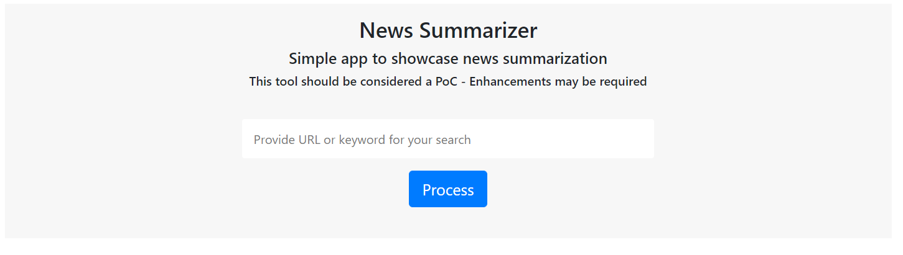
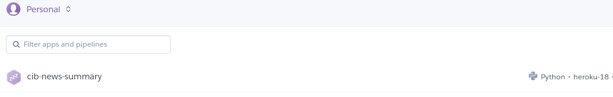

# News Summarizer App 

News Summarizer App using <strong>Python</strong> and <strong>newspaper3k</strong> to scrape and extract the summary
of news data from from a given URL using <strong>requests</strong> and transform and load the extracted data
using <strong>WTforms</strong> and <strong>Flask</strong>. The app demoed can be found
<a href="https://cib-news-summarization-alpha.herokuapp.com/" target="_blank">here</a>.

The search bar accepts either a valid URL or keyword(s). When:

- URL is provided, summarization of the news associated with that URL is performed using the
<strong>newspaper3k</strong> library.

- Keyword(s) is(are) provided, the most popular news associated with said query is obtained by means of
<strong>newsAPI</strong> library. For this library a valid API key must be provided and stored under the
_credentials_ folder

For form input handling and validation, <strong>WTForms</strong> and <strong>requests</strong> libraries are used to
grab the URL link entered in the form. 

The following data is rendered on the first part of the result page:

<strong>Title</strong> 
<strong>Published date</strong> 
<strong>Author</strong> 
<strong>Main image</strong> 
<strong>Summary </strong> 
<strong>Keywords </strong>

## For Deployment on Heroku

The following steps explain how to do deployment of this app on Heroku:

1. In case you do not have a `requirements.txt` file, generate one by typing in the following command in your
conda/virtual environment: `pip freeze -l > requirements.txt`

2. You may want to ensure you have the package `gunicorn==19.9.0` in the list of your requirements.

3. Make sure to include `runtime.txt` to specify the python version used for the deployment with Heroku.

4. Also be sure to include `Procfile` which contains the instructions for Heroku at the time the app will be initiated.

5. Get the [**Heroku CLI**](https://devcenter.heroku.com/articles/heroku-cli) on your local

6. On your local type in `heroku create name-of-app` (in this case we have chosen cib-news-summary to be the name of the app to be created)

7. Upon completion you should be able to see the name of the app in your heroku personal account

   
    
   nothing will be displayed in the app as we have not pushed any code to it yet.

8. In order to push your local code to heroku remote, type in `git push heroku test:master`. Here master is the
remote (Heroku) branch and test is your current local branch. Upon completion you should be able to see your app
working.

9. In case you want to create multiple versions of the app in Heroku, you can do so by doing the following:

     - Create a new app in Heroku as you did before (step 6): `heroku create app-name-version`
     
     - Create a new remote branch in Heroku: `git remote add app-version-name GIT_URL`. GIT_URL with the Git URL that you
     can find in the settings page of my-app-prod in heroku
     
     - Deploy model: `git push app-version-name test:master`. This is just like step 8 above.
     E.g: If `dev` is current local branch ->  `git push alpha-heroku dev:master`
     
     - _Extra_. This [stackoverflow thread](https://stackoverflow.com/questions/18264621/how-do-i-push-different-branches-to-different-heroku-apps) discusses this situation in depth.

## Generals

Here are some links to test the app against:

- https://techcrunch.com/2020/11/17/amazon-launches-amazon-pharmacy-its-delivery-service-for-prescription-medications/

- https://www.bbc.com/news/technology-55044568
